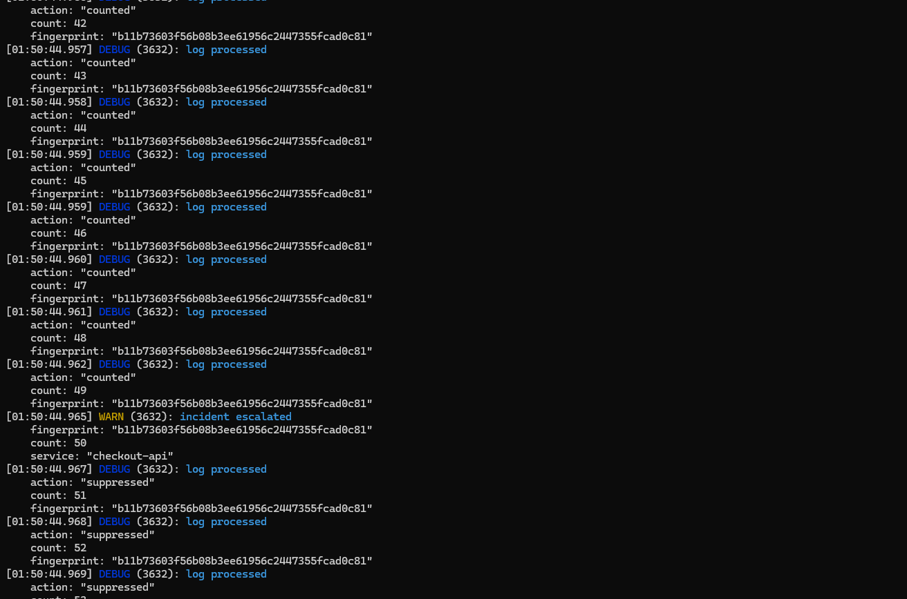
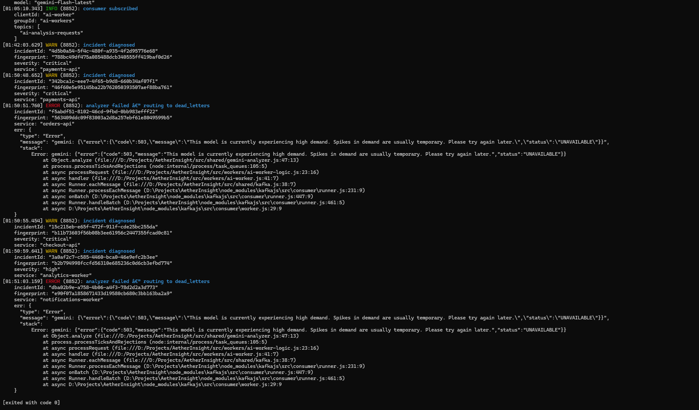
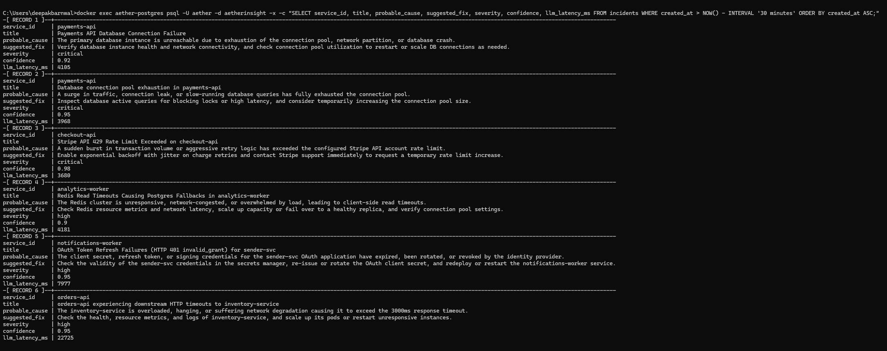

# AetherInsight

A real-time distributed log analyzer that watches error streams from multiple services, detects when a pattern is "storming," and asks an LLM (Google Gemini) to diagnose the root cause — writing structured incidents to Postgres and notifying downstream consumers via Kafka.

This is a portfolio project I built to learn distributed-systems patterns hands-on: Kafka topics as async pipelines, Redis for hot-path counting and idempotency, Postgres as a system of record, and a fake/real analyzer split so I could develop the pipeline before touching a paid API.

---

## What it does, in one sentence

Fire hundreds of production-shaped error logs at it → within seconds it collapses them into distinct incidents, each with an LLM-generated title, probable cause, suggested fix, severity, and confidence score — while dedup and retry logic keep the LLM bill sane and the failure path observable.

---

## Architecture


Three Node services talk over Kafka topics and share state in Redis + Postgres:

| Service | Reads from | Writes to | Job |
|---|---|---|---|
| **Ingestion API** (Fastify) | HTTP `POST /ingest` | `raw-logs` topic | Validates + envelopes incoming logs |
| **Filter Worker** | `raw-logs` topic | `ai-analysis-requests` topic, Redis | Fingerprints, counts in a sliding window, claims escalations |
| **AI Worker** | `ai-analysis-requests` topic | `diagnosed-incidents` topic, Postgres | Calls Gemini, stores the incident |

Everything runs in Docker (Redpanda for Kafka, Redis 7, Postgres 15). The Node workers run on the host during development.

---

## How the pipeline actually thinks

1. A log lands on `POST /ingest` → wrapped in a versioned envelope → published to `raw-logs`.
2. The Filter Worker normalizes the message ("`user id 42`" → "`user id <*>`") and hashes it into a **fingerprint**. Similar errors collapse to the same fingerprint.
3. Redis holds a **10-second sliding window** counter per `(service, fingerprint)`. Each new log adds a timestamp; old ones age out.
4. When the counter crosses **50 events / 10 seconds**, the worker tries to **claim** exclusive rights to escalate this fingerprint (Redis `SET NX EX`, 15-minute TTL). Only one worker wins.
5. The winner packages ~20 recent sample logs into an escalation event and publishes it to `ai-analysis-requests`.
6. The AI Worker consumes the escalation, builds a prompt, and calls Gemini — with `responseSchema` so the reply is **guaranteed** to be valid JSON with the six fields I need.
7. The diagnosis is inserted into the `incidents` table (with `ON CONFLICT DO NOTHING` on the envelope ID) and echoed onto the `diagnosed-incidents` topic for downstream consumers.

The full end-to-end round-trip on a real Gemini call is typically 4–8 seconds.

---

## What I built and what I learned

### 1. Sliding windows, not static counters

My first instinct was to use a plain counter (`INCR`), but that doesn't answer "is this error storming *right now*?" — it just says "has it ever happened a lot?" A sliding window answers the burst question directly. I ended up implementing it as a Redis Sorted Set with timestamps as scores and a tiny **Lua script** that atomically evicts old entries, adds the new one, and returns the count. That atomicity matters: without it two workers can both read 49, both write 50, and both escalate.

### 2. The claim is what makes the LLM affordable

If I just fingerprinted + counted, a 500-error storm would send 500 requests over the threshold and trigger 500 Gemini calls. That is a "how much money did I burn overnight" bug. The Redis claim (`SET NX EX claim:<fingerprint>`) means the *first* crossing wins the right to call the LLM; every subsequent event checks and loses. One Gemini call per storm, per 15 minutes. This is by far the cheapest line of code in the whole project.

### 3. Fake analyzer first, then swap in real Gemini

I built the whole pipeline against a `createFakeAnalyzer()` that returns deterministic output from the fingerprint — no API key, no network, tests run in milliseconds. The AI worker's composition root reads `GEMINI_API_KEY` at startup and picks the real or fake adapter. This let me iterate on the pipeline for a week before spending a single free-tier token.

```js
const analyzer = config.GEMINI_API_KEY
  ? createGeminiAnalyzer({ apiKey: config.GEMINI_API_KEY, model: config.GEMINI_MODEL })
  : createFakeAnalyzer();
```

Both implement the same three-method port. This is Hexagonal Architecture in miniature.

### 4. Structured JSON output, not prompt engineering

I originally planned to parse Gemini's freeform response, retry on malformed JSON, backfill missing fields. Then I discovered `responseSchema` — you hand Gemini a schema and it **cannot** generate anything else. Zero parse errors, zero retry loops for shape reasons. The analyzer's output type (`title, summary, probable_cause, suggested_fix, confidence, severity`) matches the DB columns 1:1 so there's no translation layer either.

### 5. Three-link idempotency chain

Kafka is at-least-once. Duplicates *will* happen. Three defenses:
- **Redis claim** → same escalation almost never fires twice
- **Envelope ID reuse** → if it does fire twice, the incident uses the same UUID
- **Postgres `ON CONFLICT (id) DO NOTHING`** → whatever slipped past the first two dies here

When `insertIncident` returns `inserted: false`, the AI worker **skips publishing** to `diagnosed-incidents`. Dashboards never get double-notified. Retrying the same message a hundred times still produces exactly one incident and one notification.

### 6. Dead-letter table for what fails, not what's malformed

I use two different failure destinations: undecodable Kafka messages (bad envelope, wrong version) go to the `dead-letter` topic; failures during processing (analyzer error, DB error) go to a `dead_letters` **table**. The table has the original payload plus the error message, so an operator can inspect and manually retry. This distinction — "the message itself is broken" vs "the message is fine, the world isn't" — was worth building.

### 7. Retry-with-backoff belongs in the adapter

Free-tier Gemini returns 503 UNAVAILABLE fairly often under bursts. Initially my AI worker just gave up on the first error and dead-lettered — technically correct, practically annoying. I moved retry-with-exponential-backoff **inside the Gemini adapter**, so the worker's business logic stays clean and every future adapter (Claude, OpenAI, local Llama) can own its own reliability strategy. My retry loop logs each attempt with the HTTP code and backoff, so when a Gemini call takes 22 seconds instead of 4, the logs tell you exactly why.

### 8. The `llm_latency_ms` column is the observability payoff

Every incident stores the wall-clock time for the analyzer call. When you see a row with `llm_latency_ms = 22725`, you instantly know Gemini flapped and the retry loop paid off. This is the difference between "the API is slow sometimes" and "here is the receipt."

### 9. Testing without mocks where it counts

The AI Worker logic is tested against a **real Postgres** running in Docker (via `docker compose`) with the fake analyzer. Not mocks. The one time I wrote a test with a mocked DB it passed for the wrong reason; the integration version caught a bug in my idempotency SQL immediately. 63 tests, all against real infra where it matters.

---

## Tech stack

- **Node 22** (ESM, top-level await, native `fetch`)
- **Fastify** — ingestion API
- **KafkaJS** + **Redpanda** — the pipeline
- **ioredis** + **Lua** — atomic sliding-window counting
- **Postgres 15** + **pg** driver — system of record
- **@google/genai** — Gemini SDK with structured output
- **zod** — boundary validation at every public entry point
- **pino** — structured JSON logs
- **vitest** — 63 tests, real infra

---

## Running it yourself

**Prereqs:** Docker Desktop, Node 22, a free-tier Gemini API key (from [aistudio.google.com/apikey](https://aistudio.google.com/apikey)).

```bash
# 1. Bring up infra
docker compose up -d

# 2. Set up env
cp .env.example .env
# then edit .env and paste your GEMINI_API_KEY

# 3. Install + create Kafka topics
npm install
npm run topics

# 4. In three separate terminals, start the services
npm run start:api      # http://localhost:3000
npm run start:filter
npm run start:ai

# 5. Fire the demo — 5 distinct realistic failure storms
npm run demo
```

You should see, within ~10 seconds:
- Filter Worker: 5 `"incident escalated"` lines (one per service)
- AI Worker: 5 `"incident diagnosed"` lines with real Gemini output
- 5 rows in the `incidents` table

Query the results:

```bash
docker exec aether-postgres psql -U aether -d aetherinsight -x \
  -c "SELECT service_id, title, probable_cause, suggested_fix, severity, confidence, llm_latency_ms FROM incidents ORDER BY created_at DESC LIMIT 5;"
```

Run the tests:

```bash
npm test
```

---

## End-to-end proof

### The Filter Worker crossing the threshold

The window count climbs to 50, and the worker emits `incident escalated` — from there on, subsequent events for this fingerprint are `suppressed` (the claim is held):



### The AI Worker: happy path and failure path in one shot

Five diagnoses, two dead-letters — all in the same run. The `analyzer failed — routing to dead_letters` lines are the failure path proving itself. This screenshot is from *before* I added retry-with-backoff, which is why the two 503s bubbled up.



### The five diagnoses in Postgres

The final `incidents` table after all 5 storms were re-fired against the retry-enabled analyzer. Notice `llm_latency_ms = 22725` on the last row — that's the retry loop earning its keep on a run where Gemini 503'd four times in a row before succeeding.



### Earlier development snapshots

The same insights, captured during earlier iterations of the project as I was tuning thresholds and windows:


---

## Notes and honest limitations

- The **fingerprinting** is intentionally simple (regex-based token replacement). Real log-clustering algorithms like Drain are more robust; I picked a straightforward approach so the pipeline was the star of the show, not the fingerprinter.
- Redis is **not persisted** in this setup. If Redis restarts mid-storm, the window resets. For production you'd enable AOF, or accept the reset as a bounded loss.
- **Kafka offset commits are auto** (KafkaJS default). At-least-once semantics rely on the idempotency chain above. Manual commit-after-success is a safer pattern; I traded a bit of safety for less code because the idempotency chain already handles the common cases.
- The **Gemini free tier** is genuinely rate-limited. The retry loop mostly hides this, but under a big burst you will still see occasional dead-letters. The demo is designed so this outcome is *visible*, not hidden.
- Everything is designed for a **single-node demo**; the workers scale horizontally (Kafka partitions, consumer groups) but I didn't test that path.
